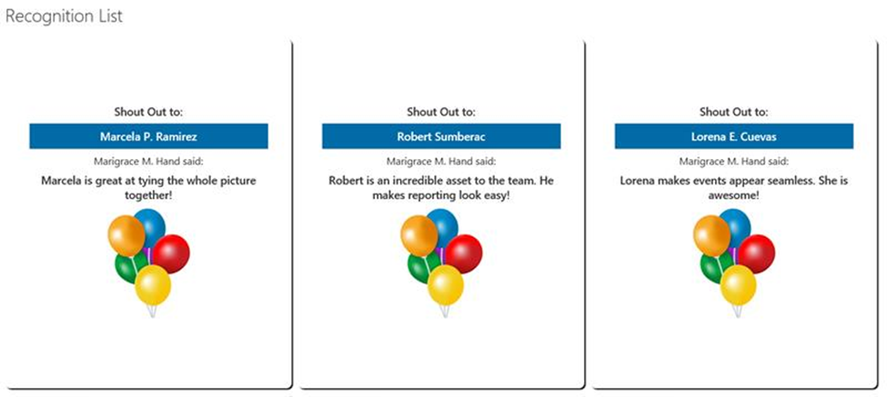

# Tiles with People and Image

## Summary
List View format that shows tiles with People/Group column type and an Image

## View Requirements

### Standard Column
- Title

### Custome Columns
Column Name|Type
-----------|----
Awarder | People or Group
Recipient | People or Group
Why | Single line of text

### Authors
- Marigrace M. Hand
- Riu Baring

## Version History
Version|Date|Comments
-------|----|--------
1.0|January 28, 2020|Initial release

## Disclaimer
**THIS CODE IS PROVIDED *AS IS* WITHOUT WARRANTY OF ANY KIND, EITHER EXPRESS OR IMPLIED, INCLUDING ANY IMPLIED WARRANTIES OF FITNESS FOR A PARTICULAR PURPOSE, MERCHANTABILITY, OR NON-INFRINGEMENT.**

## Additional Notes
None